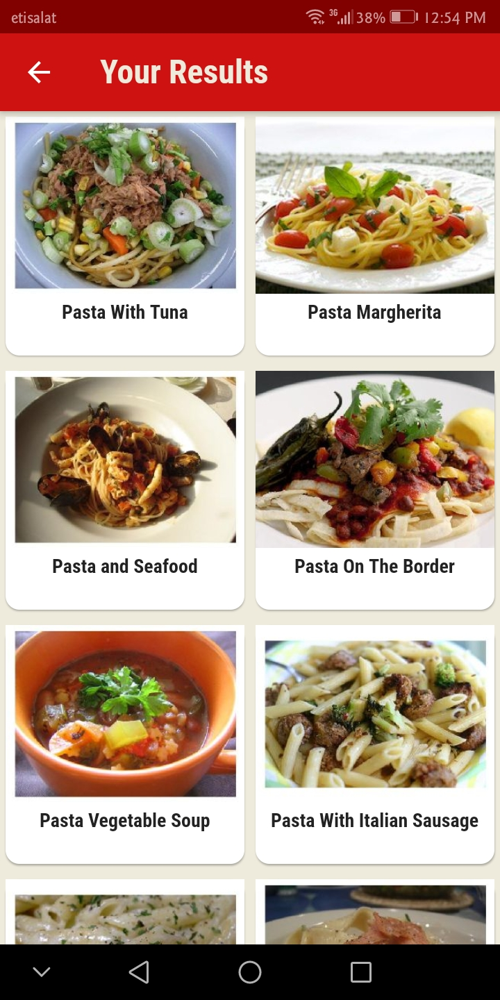
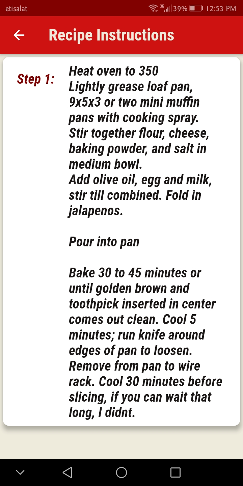

# :tomato: Two_Tomatoes :tomato:
 Flutter app for recipe ideas powered by Spoonacular's Api :books::
 - :bulb: Gives you new popular recipes each time you open the app .
 - :earth_africa: Search recipes by name or by using filters like by Cuisines, Diets or Dish Types .
 -  :spaghetti: gives you an insight for any recipes like it's origin country, ingredients and also instructions to cook it at home. 
  
                
